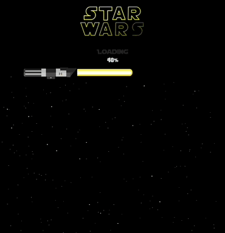

#### Olá! I'm Iasmin, a Brazilian 🇧🇷 Front-end Developer + Back-end / Data-Science student.

#### 🤓 Projects I’m currently working on ...

<table>
  <tr>
    <td valign="top">
      <h3 align="center">✨Star Wars Planets✨</h3>
      

        <a href="https://iasmin-br.github.io/Star-Wars-Planets/">Demo</a> |
        <a href="https://github.com/Iasmin-BR/Star-Wars-Planets">Repo</a>
      

      
    </td>
  </tr>
</table>

#### Stats

#### About me

My interest in coding started as a research assistant during my major/master's degrees, when I experienced the basics of R-/Python in Data Analysis applied to Neuroscience. At that time, I also implemented some simple web applications that helped managing cognitive training sessions with clinical patients from my University's Hospital. Currently, I am studying to be a full-stack web-developer.

#### 🛠️ Tools

* Javascript ES6 + HTML + CSS;
* Frontend frameworks: React.js and Redux and React hooks;
* Collaboration tools: Git & GitHub / Agile / Pair-programming;
* [Learning now] Backend technologies: building APIs + Typescript;
* [Learning soon] Data Science: Python & Data Analysis;
